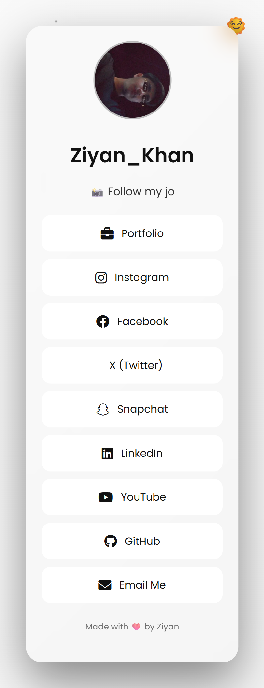
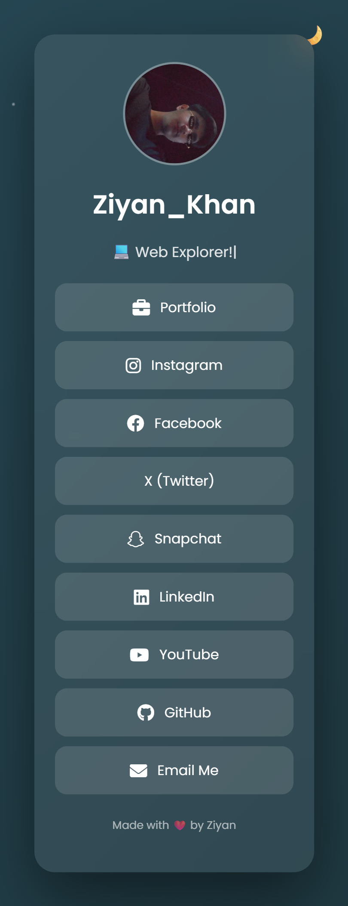

# 🔗 Social Links Website

A modern and responsive **All-in-One Social Links Website** to showcase all my social media profiles and portfolio in one place.  
Perfect for **Instagram bio**, **LinkedIn**, and **personal branding**.

---

## ✨ Features

- 🔗 All social links on a single page  
- 💼 Portfolio access  
- 🌙 Dark & ☀️ Light theme support  
- 🎨 Clean and minimal UI  
- 📱 Fully responsive design  
- ⚡ Fast and lightweight  

---

## 🛠️ Tech Stack

- HTML5  
- CSS3  
- JavaScript  

---

## 📸 Screenshots

### 🌙 Light Mode

### 🌐 Dark Mode

---

## 🚀 Live Demo

🌐 **Live Website:**  
👉  [Ziyan-Links.netlify.app](https://ziyan-links.netlify.app)
  

---

## 🧑‍💻 How to Run Locally

1. Clone or download the repository  
2. Open the folder in **VS Code**  
3. Open `index.html` in your browser  
4. Edit links and content as needed  

---

## 🌍 Deployment

This project is deployed using **Netlify**  
and connected with **GitHub** for automatic deployment.

---

## 👤 Author

**Ziyan Khan**  
Web Developer | UI/UX Enthusiast  

- 🌐 Portfolio:  [Link]( https://ziyankhan.netlify.app )
 
- 💼 LinkedIn: [Link](https://www.linkedin.com/in/ziyan-khan-b479332a7)
   
- 📸 Instagram:  [Link]( https://www.instagram.com/mr__ziyan__khan)
  

---

## ⭐ Support

If you like this project:
- ⭐ Star the repository  
- 🍴 Fork it  
- 🧑‍💻 Customize it  

---

## 📜 License

This project is **open-source** and free to use for personal and learning purposes.

